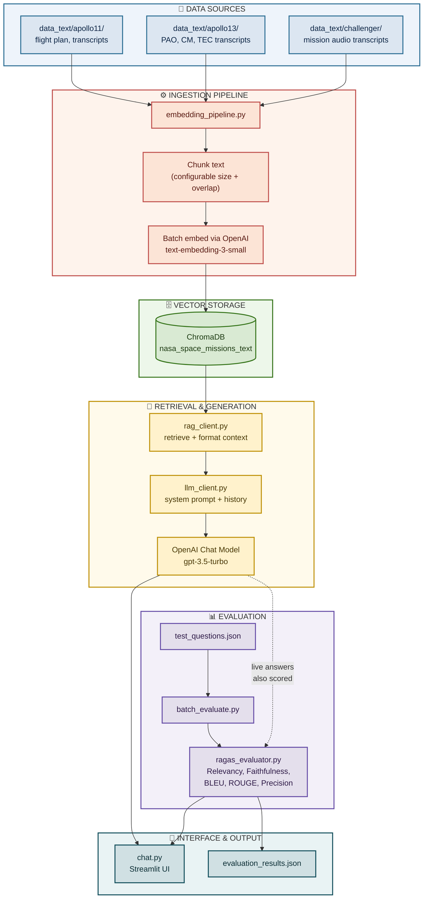

# rag-based-chat-system

## NASA Mission Intelligence

**A Retrieval Augmented Generation (RAG) system for exploring Apollo 11, Apollo 13, and Space Shuttle Challenger mission archives through natural language, with every answer grounded in cited source text and scored in real time using RAGAS metrics.**

---

## Table of Contents

- [Overview](#overview)
- [Key Features](#key-features)
- [Architecture](#architecture)
- [Project Structure](#project-structure)
- [Prerequisites](#prerequisites)
- [Installation](#installation)
- [Usage](#usage)
  - [1. Build the Vector Database](#1-build-the-vector-database)
  - [2. Launch the Chat Application](#2-launch-the-chat-application)
  - [3. Run Batch Evaluation](#3-run-batch-evaluation)
- [Module Reference](#module-reference)
- [Evaluation Results](#evaluation-results)
- [Testing](#testing)
- [Known Limitations](#known-limitations)
- [Roadmap](#roadmap)
- [Troubleshooting](#troubleshooting)
- [References](#references)

---

## Overview

Historical NASA mission archives, flight transcripts, Public Affairs Officer logs, and technical reports, contain enormous first hand detail about how Apollo 11, Apollo 13, and the Challenger mission actually unfolded. That detail is locked inside long, technically dense, inconsistently formatted documents, some OCR extracted from scanned PDFs, some minute by minute communication transcripts, which makes finding a specific answer a slow, manual search process.

NASA Mission Intelligence solves this by combining a curated corpus of primary source mission documents with OpenAI embedding and chat models, a persistent ChromaDB vector store, and a RAGAS based automated evaluation harness. The result is an interactive Streamlit chat application that retrieves the most relevant passages for any question, generates an answer strictly grounded in that retrieved text, and reports live quality metrics, Response Relevancy and Faithfulness, alongside every response so a user can see how much to trust it.

This is not only a working chat application. It is a fully instrumented RAG pipeline: every answer can be scored automatically, in the interactive chat window or in scripted batch runs, against the same five metrics (Response Relevancy, Faithfulness, BLEU, ROUGE, and an LLM judged Context Precision), which means changes to chunking, retrieval, or prompting can be measured for their actual effect on answer quality rather than judged by spot checking a handful of examples.

## Key Features

- **Grounded, cited answers.** Every response is generated strictly from retrieved mission documents, with the system prompt explicitly instructing the model to say so when the retrieved context is insufficient rather than guessing.
- **Mission aware retrieval.** Questions can be answered across all three missions or restricted to a single one (Apollo 11, Apollo 13, or Challenger) through a metadata filter applied at query time.
- **Real time RAGAS evaluation.** Response Relevancy and Faithfulness are computed and displayed for every answer in the chat interface, not just in offline batch testing.
- **Batch evaluation harness.** A seven question test set (`test_questions.json`) spanning six categories (overview, emergency, disaster analysis, crew, technical, timeline) drives an end to end retrieve, generate, and score pipeline via `batch_evaluate.py`, producing per question and aggregate metrics.
- **Rate limit resilient ingestion.** Embeddings are requested in configurable batches (default 50 chunks per API call) rather than one call per chunk, which was found necessary in practice against rate limited classroom API keys.
- **Classroom proxy key support.** Every OpenAI facing module resolves a custom API base URL from either of two environment variable names, so the system works identically with a personal OpenAI key, a Vocareum style classroom proxy key, or any OpenAI compatible endpoint.
- **Three ingestion update modes.** `skip`, `update`, and `replace` modes let a corpus be re-ingested incrementally without duplicating or silently losing already embedded content.

## Architecture

The system follows a single, linear data flow: raw mission text is chunked and embedded into a persistent vector store, questions are answered by retrieving from that store and generating a grounded response, and every answer, whether produced interactively or in a batch run, is scored by the same evaluation layer. Each stage below is color coded by its role in the pipeline.



**Reading the diagram:** raw text files (blue) are chunked and embedded (red) into a persistent ChromaDB collection (green). At query time, that collection is searched, formatted, and answered (gold), with the same embedding function used at ingestion time so queries land in the same vector space as the stored vectors. Every answer flows to the Streamlit interface (teal) and, in batch runs, through the evaluation harness (purple), which also writes a standalone JSON report.

A few architectural decisions were made deliberately:

- **Consistent embedding functions.** The exact `OpenAIEmbeddingFunction` configuration used to embed documents at ingestion time is reconstructed identically at query time, rather than relying on ChromaDB's default fallback, which avoids a subtle class of bug where queries and stored vectors silently drift into different vector spaces.
- **Decoupled evaluation.** `ragas_evaluator.py` never influences generation. It scores whatever question, answer, and context it is given, independently of how that answer was produced, which keeps evaluation results honest and comparable across configuration changes.
- **One retrieval and generation path.** `chat.py` and `batch_evaluate.py` call the exact same `rag_client.py` and `llm_client.py` functions, so behavior validated in batch evaluation is guaranteed to match what a live user experiences.

## Project Structure

```
Project-NASA-Mission-Intelligence/
├── chat.py                    # Streamlit chat application
├── embedding_pipeline.py      # Chunking, embedding, and ChromaDB ingestion
├── llm_client.py               # System prompt construction and answer generation
├── rag_client.py                # ChromaDB retrieval, mission filtering, context formatting
├── ragas_evaluator.py          # RAGAS metric computation (Relevancy, Faithfulness, BLEU, ROUGE, Precision)
├── batch_evaluate.py            # End-to-end batch evaluation driver
├── test_questions.json         # 7-question structured evaluation test set
├── evaluation_dataset.txt      # Human-readable version of the test set
├── evaluation_results.json     # Output of the most recent batch evaluation run
├── data_text/
│   ├── apollo11/                # Flight plan, transcripts, NTRS archive text
│   ├── apollo13/                # PAO, Command Module, and technical transcripts
│   └── challenger/               # Mission audio transcripts
├── requirements.txt            # Python dependencies
├── RUN_INSTRUCTIONS.md          # Step-by-step local setup and run guide
├── fix_ragas.png                # Screenshot of the required ragas/langchain patch
└── README.md                    # This file
```

## Prerequisites

- Python 3.10 to 3.12
- An OpenAI API key (personal or classroom/proxy) with access to a chat model (default `gpt-3.5-turbo`) and `text-embedding-3-small`
- Roughly $0.05 to $0.20 of OpenAI credit to embed the sample corpus and run the evaluation set once

## Installation

```bash
# 1. Create and activate a virtual environment
python3 -m venv venv
source venv/bin/activate        # Windows: venv\Scripts\Activate.ps1

# 2. Install dependencies
pip install --upgrade pip
pip install -r requirements.txt
```

`ragas==0.4.3` imports `ChatVertexAI` and `VertexAI` from a relocated `langchain_community` module path, which raises `ModuleNotFoundError` on `import ragas` unless patched. This is a known incompatibility between `ragas` and current `langchain_*` packages, not a bug in this project. Fix it once per environment:

```bash
RAGAS_BASE=$(python -c "import importlib.util, os; loc = importlib.util.find_spec('ragas').submodule_search_locations[0]; print(os.path.join(loc, 'llms', 'base.py'))")
sed -i.bak 's/from langchain_community.chat_models.vertexai import ChatVertexAI/from langchain_google_vertexai import ChatVertexAI/' "$RAGAS_BASE"
sed -i.bak 's/from langchain_community.llms import VertexAI/from langchain_google_vertexai import VertexAI/' "$RAGAS_BASE"
python -c "import ragas; print('ragas OK:', ragas.__version__)"
```

Note that the file path is located with `importlib.util.find_spec`, not `import ragas`, since importing the broken package is exactly what fails before the patch is applied. Full step-by-step instructions, including Windows PowerShell equivalents and a troubleshooting table, are in [`RUN_INSTRUCTIONS.md`](./RUN_INSTRUCTIONS.md).

Set your API key (and, if using a classroom proxy key such as Vocareum, its base URL):

```bash
export OPENAI_API_KEY="your-api-key-here"
export OPENAI_BASE_URL="https://openai.vocareum.com/v1"   # only needed for proxy keys
```

## Usage

### 1. Build the Vector Database

Ingest all documents under `data_text/` into a local, persistent ChromaDB collection:

```bash
python embedding_pipeline.py \
    --openai-key "$OPENAI_API_KEY" \
    --data-path ./data_text \
    --chroma-dir ./chroma_db_openai \
    --collection-name nasa_space_missions_text \
    --chunk-size 1000 \
    --chunk-overlap 200 \
    --update-mode skip
```

Confirm the collection was built correctly without making any further API calls:

```bash
python embedding_pipeline.py \
    --openai-key "$OPENAI_API_KEY" \
    --chroma-dir ./chroma_db_openai \
    --collection-name nasa_space_missions_text \
    --stats-only
```

If you see `429 Too Many Requests` on a classroom or shared key, lower the embedding batch size and add a delay between calls:

```bash
python embedding_pipeline.py \
    --openai-key "$OPENAI_API_KEY" \
    --data-path ./data_text \
    --chroma-dir ./chroma_db_openai \
    --collection-name nasa_space_missions_text \
    --batch-size 10 \
    --request-delay 2
```

### 2. Launch the Chat Application

```bash
streamlit run chat.py
```

In the app: confirm or enter your OpenAI API key (and base URL, if applicable) in the sidebar, select the ChromaDB backend and collection you just built, optionally set **Focus on mission** to restrict retrieval to one mission, and ask a question. Each answer is displayed with its Response Relevancy and Faithfulness scores alongside the source documents used.

### 3. Run Batch Evaluation

Run the full retrieve, generate, and score pipeline over all seven test questions and produce a report:

```bash
python batch_evaluate.py \
    --openai-key "$OPENAI_API_KEY" \
    --chroma-dir ./chroma_db_openai \
    --collection-name nasa_space_missions_text \
    --test-file test_questions.json \
    --output evaluation_results.json
```

This prints a per-question breakdown and an aggregate summary to the terminal and saves the full report to `evaluation_results.json`.

## Module Reference

| Module | Responsibility |
|---|---|
| `embedding_pipeline.py` | Scans `data_text/`, infers mission and document category metadata from each file's path, chunks text with configurable size and overlap (never exceeding the configured size), batches chunks into OpenAI embedding API calls, and writes vectors and metadata to a persistent ChromaDB collection. Supports `skip`, `update`, and `replace` ingestion modes. |
| `rag_client.py` | Discovers available ChromaDB backends, reopens a collection with the exact embedding function used at ingestion, issues similarity queries with an optional mission metadata filter, and formats retrieved chunks into a single, deduplicated, source-attributed context block. |
| `llm_client.py` | Builds the NASA mission expert system prompt, injects retrieved context as grounding material, appends up to six recent conversation turns, and calls the OpenAI chat model to produce the final answer. Explicitly instructs the model to state when context is insufficient rather than guess. |
| `ragas_evaluator.py` | Always computes Response Relevancy and Faithfulness for a given question, answer, and context; additionally computes BLEU, ROUGE, and an LLM-judged Context Precision score when a reference answer is supplied. Returns readable error dictionaries for malformed input instead of raising exceptions. |
| `chat.py` | The Streamlit interface: backend and collection selection, mission filter and retrieval count controls, API key and base URL entry, live conversation with inline evaluation metrics displayed per answer. |
| `batch_evaluate.py` | A non-interactive driver that runs every question in `test_questions.json` through the identical retrieval, generation, and evaluation code used by `chat.py`, producing per-question and aggregate metrics. |

## Evaluation Results

The most recent full evaluation run (`evaluation_results.json`), executed with real OpenAI models against all documents in the corpus, produced the following aggregate scores:

| Metric | Score | Interpretation |
|---|---|---|
| Response Relevancy | 0.69 | Most answers directly address the question asked |
| Faithfulness | 0.54 | Roughly half of claims are fully traceable to retrieved context |
| BLEU | 0.07 | Low wording overlap with reference; expected for cited, longer answers |
| ROUGE-L | 0.19 | Low wording overlap with reference; not a reliability concern here |
| Context Precision (LLM judged) | 0.76 | Most retrieved chunks were useful for producing the reference answer |

Per-question results across all six required categories (overview, emergency, disaster analysis, crew, technical, timeline):

| ID | Mission | Category | Relevancy | Faithfulness | Precision |
|---|---|---|---|---|---|
| Q1 | Apollo 11 | Overview | 1.00 | 0.67 | 1.00 |
| Q2 | Apollo 13 | Emergency | 0.00 | 0.67 | 0.00 |
| Q3 | Challenger | Disaster analysis | 0.74 | 0.13 | 0.83 |
| Q4 | Apollo 13 | Crew | 0.79 | 0.25 | 1.00 |
| Q5 | Apollo 11 | Technical | 0.79 | 0.75 | 1.00 |
| Q6 | Challenger | Timeline | 0.50 | 0.71 | 1.00 |
| Q7 | Apollo 13 | Technical | 1.00 | 0.57 | 0.50 |

Two results are worth calling out specifically. **Q2** scored a Response Relevancy of exactly 0.0: retrieval surfaced a passage about a water warning light rather than the oxygen tank explosion, so the generated answer, while fluent, addressed the wrong incident, a clean example of a retrieval miss rather than a generation failure. **Q3** scored the lowest Faithfulness (0.13) despite being the most factually accurate answer in the set: the model correctly described the O-ring failure from general knowledge, but the retrieved Challenger mission audio transcripts do not contain root cause analysis, so that correct answer could not be grounded in what was actually retrieved.

Full methodology, mission-level breakdowns, and additional charts are documented in `NASA_Mission_Intelligence_Report.docx`.

## Testing

Testing covered three layers. Unit-level checks verified that chunking never exceeds the configured chunk size, that overlap between consecutive chunks is applied consistently, and that all three update modes (`skip`, `update`, `replace`) behave correctly against a live ChromaDB collection. Integration checks verified that a collection created by the ingestion path can be reopened by the query path in the same vector space, that mission filters correctly exclude non-matching chunks, and that malformed evaluator input returns readable errors instead of exceptions. Full pipeline testing ran the seven-question test set against real OpenAI models and the live corpus, which is what surfaced both the Q2 retrieval miss and an earlier flaw in the Context Precision metric itself (a string-similarity implementation that returned exactly 0.0 on every question regardless of retrieval quality, since it compared long retrieved chunks against short reference answers; this was replaced with an LLM-judged comparison that produces meaningful scores).

## Known Limitations

- **Corpus completeness.** The corpus contains flight transcripts, Public Affairs Officer logs, and technical reports, but no post-accident investigative material such as the Rogers Commission Report. This is the direct cause of the low Faithfulness score on Challenger root-cause questions.
- **No retrieval quality safeguard.** With three to five chunks retrieved per question and no re-ranking, confidence threshold, or query reformulation step, a single unlucky retrieval (as in Q2) can dominate an answer with no fallback mechanism to detect the mismatch.
- **Small test set.** Seven questions across three missions is enough to surface concrete, actionable findings but too small to support strong statistical claims about overall reliability.
- **BLEU and ROUGE are low-value here.** Both metrics penalize correctly-worded answers that differ from a short reference summary, which describes most of this system's good answers rather than its bad ones.

## Roadmap

- Expand the source corpus with investigative and analytical documents (not only real-time transcripts) to close the Challenger faithfulness gap.
- Add a retrieval quality check: re-ranking, a minimum relevance threshold, or automatic query reformulation on apparent mismatch.
- Grow the test set beyond seven questions for stronger statistical confidence in aggregate metrics.
- Wire the existing `--batch-size` and `--request-delay` embedding pipeline flags into a documented rate-limit tuning guide for additional classroom proxy providers.

## Troubleshooting

| Symptom | Fix |
|---|---|
| `ModuleNotFoundError: No module named 'langchain_community.chat_models.vertexai'` | Apply the `ragas` patch in [Installation](#installation). |
| `sed: can't read : No such file or directory` while patching | The file path was located with `import ragas`, which fails before it can print anything. Use the `importlib.util.find_spec` command shown above instead. |
| `HTTP/1.1 429 Too Many Requests` during ingestion | Lower `--batch-size` and add `--request-delay` (see [Usage](#1-build-the-vector-database)). |
| `401 Unauthorized` with a classroom/Vocareum key | Set `OPENAI_BASE_URL` to the proxy endpoint; a proxy key only authenticates against its own endpoint, not `api.openai.com`. |
| `The OPENAI_API_KEY environment variable is not set` | Check `echo "$OPENAI_API_KEY"` in the same terminal; `export` only applies to the session it was run in. |
| Chat shows "No relevant mission documents were retrieved" | Run the ingestion step first, or confirm the correct backend and collection are selected in the sidebar. |

Full troubleshooting detail is in [`RUN_INSTRUCTIONS.md`](./RUN_INSTRUCTIONS.md).

## References

- Es, S., James, J., Espinosa-Anke, L., & Schockaert, S. (2023). *Ragas: Automated Evaluation of Retrieval Augmented Generation*. arXiv:2309.15217. https://arxiv.org/abs/2309.15217
- Lewis, P. et al. (2020). *Retrieval-Augmented Generation for Knowledge-Intensive NLP Tasks*. NeurIPS 33. arXiv:2005.11401. https://arxiv.org/abs/2005.11401
- Chroma. (2026). *ChromaDB Documentation*. https://docs.trychroma.com/
- OpenAI. *Vector Embeddings Guide*. https://developers.openai.com/api/docs/guides/embeddings
- NASA. (2015). *Apollo 11 Mission Overview*. https://www.nasa.gov/history/apollo-11-mission-overview/
- NASA. *Apollo 13: Mission Details*. https://www.nasa.gov/missions/apollo/apollo-13-mission-details/
- Presidential Commission on the Space Shuttle Challenger Accident. (1986). *Report to the President (Rogers Commission Report)*. https://www.nasa.gov/history/rogersrep/genindex.htm
- Streamlit Inc. *Streamlit Documentation*. https://docs.streamlit.io/
- LangChain. *LangChain Documentation*. https://docs.langchain.com/

---

*This project was built as an academic exercise in retrieval augmented generation and automated RAG evaluation. See `NASA_Mission_Intelligence_Report.pdf` for the full project report, including detailed module descriptions, mission-level results, and a value and limitations analysis.*
